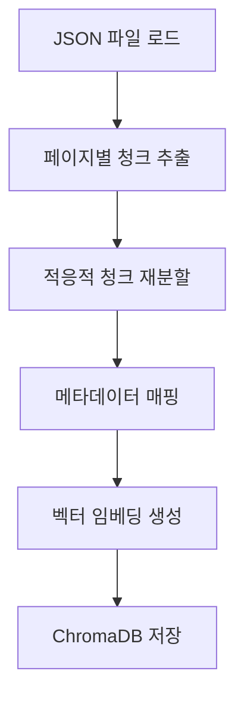
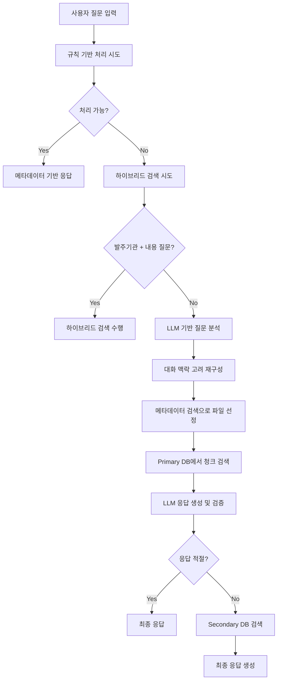

# 보고서

# 공공입찰 공고 문서 질의응답 시스템 개발 보고서

## 📋 목차

1. 프로젝트 개요
2. 시스템 아키텍처
3. 개발 환경
4. 워크플로우
5. 핵심 기능
6. 개발 방식
7. 개발 이슈 및 해결과정
8. 성능 최적화
9. 향후 개선사항

---

## 📊 프로젝트 개요

### 프로젝트 목적

공공입찰 공고 문서에 대한 자연어 질의응답을 통해 사용자가 필요한 정보를 효율적으로 검색하고 획득할 수 있는 시스템 개발

### 주요 목표

- **정확한 정보 검색**: 사용자 질문에 대해 관련성 높은 문서 내용 제공
- **대화 맥락 유지**: 연속된 질문에서 이전 대화 내용을 고려한 응답 생성
- **다양한 질문 유형 지원**: 메타데이터 조회, 문서 내용 검색, 비교 분석 등
- **확장 가능한 구조**: 모듈화를 통한 유지보수성 및 확장성 확보

### 시스템 특징

- **하이브리드 검색**: 메타데이터 기반 + 문서 내용 기반 검색
- **LLM 호출 최적화**: 불필요한 API 호출 최소화
- **다중 문서 DB 지원**: Primary/Secondary DB를 통한 검색 품질 향상
- **대화 맥락 관리**: 이전 대화 내용을 고려한 질문 재구성

---

## 🏗️ 시스템 아키텍처

### 전체 시스템 구조

```

[사용자 질문]
    ↓
[질문 분석 및 재구성] ← LLM (GPT-4.1-mini)
    ↓
[검색 방식 결정]
    ├── 규칙 기반 메타데이터 처리
    ├── 하이브리드 검색 (발주기관 + 내용)
    └── 일반 검색 (메타데이터 → 문서 내용)
    ↓
[다중 DB 검색]
    ├── Primary DB (MUP 데이터)
    └── Secondary DB (Plumber 데이터)
    ↓
[응답 생성 및 검증] ← LLM (GPT-4.1-mini)
    ↓
[최종 응답 출력]

```

### 데이터베이스 구조

- **메타데이터 벡터 DB**: 사업명 + 발주기관 임베딩
- **문서 벡터 DB (Primary)**: MUP 데이터 청크 임베딩
- **문서 벡터 DB (Secondary)**: Plumber 데이터 청크 임베딩
- **메타데이터 DataFrame**: 구조화된 사업 정보

---

## 💻 개발 환경

### 플랫폼 및 도구

- **개발 환경**: Google Colab Pro
- **Python 버전**: 3.11
- **주요 라이브러리**:
    - `langchain` (0.2.x): 벡터 DB 및 텍스트 처리
    - `langchain-openai`: GPT 모델 연동
    - `langchain-huggingface`: 한국어 임베딩 모델
    - `chromadb`: 벡터 데이터베이스
    - `pandas`, `numpy`: 데이터 처리
    - `openai`: LLM API 연동

### 모델 및 API

- **LLM**: GPT-4.1-mini (OpenAI)
- **임베딩 모델**: `snunlp/KR-SBERT-V40K-klueNLI-augSTS` (한국어 특화)
- **벡터 DB**: ChromaDB (로컬 저장)

### 데이터 구조

```json

json
{
  "filename": "사업파일명.json",
  "page_number": 1,
  "merged_page_content": "페이지 내용..."
}

```

---

## 🔄 워크플로우

### 1. 데이터 전처리 단계



### 2. 질문 처리 워크플로우



### 3. 대화 맥락 관리

- **엔티티 추출**: 사업명, 발주기관, 파일명 등
- **맥락 연결 판단**: 지시어, 복수 참조 표현 등 분석
- **질문 재구성**: 이전 대화를 고려한 구체적 질문 생성

---

## ⚙️ 핵심 기능

### 1. 지능형 질문 분석

```python

python
def process_with_llm(query, conversation_context, df, chat):
    """
    LLM을 통한 질문 분석:
    - metadata_only: 메타데이터만으로 처리 가능 여부
    - rule_based_query: 규칙 기반 처리 가능 여부
    - reformulated_query: 대화 맥락 고려한 질문 재구성
    - entities: 사업명-발주기관 페어 추출
    - search_keywords: 문서 검색용 핵심 키워드
    """

```

### 2. 다중 검색 전략

### 규칙 기반 메타데이터 처리

- 사업 금액 관련: "가장 큰", "최대", "이상" 등 패턴 인식
- 발주 기관 관련: "모든", "전체", "리스트" 등
- 날짜 관련: "최근", "가장 최근", "오래된" 등

### 하이브리드 검색

- 발주기관 + 내용 관련 질문 감지
- 메타데이터로 파일 선정 → 해당 파일 내 내용 검색

### 일반 검색

- 엔티티 기반 메타데이터 검색으로 파일 선정
- 키워드 기반 청크 검색
- Primary/Secondary DB 순차 검색

### 3. 대화 맥락 관리

```python

python
class ConversationManager:
    """
    - 최근 대화 기록 유지 (기본 5개)
    - 엔티티 추출 및 저장
    - 맥락 기반 질문 재구성 지원
    """

```

**맥락 연결 규칙**:

- 지시어 기반: "그럼", "그", "해당" → 직전 질문 연결
- 복수 참조: "각각", "둘 다" → 이전 언급 사업들 참조
- 새로운 범위: "다른", "별도" → 맥락 연결 방지

---

## 🛠️ 개발 방식

### 1. 점진적 개발 (Incremental Development)

- **1단계**: 기본 질의응답 시스템 구축
- **2단계**: 메타데이터 기반 검색 추가
- **3단계**: 대화 맥락 관리 기능 구현
- **4단계**: 하이브리드 검색 및 다중 DB 지원
- **5단계**: LLM 호출 최적화

### 2. 모듈화 설계

```python

python
# 핵심 모듈 분리
- load_documents(): 데이터 로드 및 전처리
- create_metadata_db(): 메타데이터 벡터 DB 생성
- create_document_db(): 문서 벡터 DB 생성
- process_with_llm(): LLM 기반 질문 분석
- optimized_process_query(): 통합 질문 처리
- ConversationManager: 대화 맥락 관리

```

### 3. 프롬프트 엔지니어링

- **시스템 프롬프트**: 명확한 역할 정의 및 작업 지시
- **Human 프롬프트**: 구체적인 예시 및 JSON 형식 지정
- **표준화 규칙**: 메타데이터 질문의 일관된 재구성

### 4. 성능 모니터링

- 청크 길이 분포 분석
- 검색 유사도 점수 모니터링
- LLM 호출 횟수 추적
- 처리 시간 측정

---

## 🚫 개발 이슈 및 해결과정

### 1. LLM 호출 최적화 문제

**문제**: 초기 버전에서 질문당 3-4회 LLM 호출로 비용 및 지연 발생

**해결과정**:

- 대화 맥락 파악과 메타데이터 처리를 하나의 LLM 호출로 통합
- 응답 생성과 적절성 검증을 동시 수행하는 JSON 형식 도입
- 규칙 기반 처리 우선순위를 높여 LLM 호출 빈도 감소

**최종 결과**: 평균 2회 호출 (기본) + 필요시 1회 추가

### 2. 대화 맥락 처리의 복잡성

**문제**: 다양한 대화 패턴에서 맥락 연결 실패

**상황별 해결**:

- **새로운 검색 범위**: "다른 기관" 질문 시 이전 사업명 제외
- **동일 사업 후속**: "그럼" 등 지시어로 직전 사업 연결
- **복수 사업 참조**: "각각" 표현으로 이전 언급 사업들 포함

**구현 방법**:

```python

python
# 맥락 연결 판단 로직
1. 현재 질문에 이전 대화의 동일 기관명 있는가?
2. "각각", "둘 다" 등 복수 참조 표현 있는가?
3. "다른", "별도" 등 새로운 범위 키워드 없는가?
→ 모두 YES면 구체적 사업명 포함하여 재구성

```

### 3. 메타데이터 질문 표준화

**문제**: 다양한 표현의 메타데이터 질문이 규칙 기반 처리 실패

**예시**:

- "가장 많은 자금이 배정된" → 규칙 기반 처리 실패
- "사업 금액이 가장 큰" → 규칙 기반 처리 성공

**해결방법**:

- LLM 프롬프트에 표준화 규칙 추가
- 규칙 기반 처리 패턴 확장

```python

python
# 표준화 예시
"가장 많은 자금", "예산 규모가 최대" → "사업 금액이 가장 큰"
"어떤 기관에서", "누가 발주한" → "발주 기관"

```

### 4. 검색 정확도 향상 문제

**문제**: 단순 질문 전체로 검색 시 노이즈 발생

**개선 과정**:

1. **엔티티 기반 파일 선정**: 사업명+발주기관으로 관련 파일 먼저 선정
2. **키워드 기반 청크 검색**: 추출된 핵심 키워드로 해당 파일 내 정확한 청크 검색
3. **파일별 청크 수 제한**: 파일당 5개로 제한하여 품질 향상(질문 쿼리가 두개의 사업에 대한 질문이면 각각 5개씩 10개 검색)

### 5. 다중 문서 DB 통합 문제

**문제**: Primary DB에서 관련 정보 부족 시 대안 필요

**해결 구조**:

```python

python
# 2단계 검색 시스템
1. Primary DB 검색 → LLM 응답 생성 및 적절성 검증
2. 적절하지 않으면 → Secondary DB 검색 → 최종 응답

```

**핵심 개선점**:

- LLM이 응답과 검증을 동시 수행 (JSON 형식)
- 불필요한 검색 방지 및 API 호출 최소화

### 6. JSON 파싱 안정성 문제

**문제**: LLM이 반환하는 JSON 형식과 질문 재구성시 일관성 부족

**해결방법**:

- `temperature=0` + `seed=42` 설정으로 일관성 향상
- 정규표현식을 통한 JSON 부분 추출
- 파싱 실패 시 기본값 처리 로직 추가

---

## 📈 성능 최적화

### 1. LLM 호출 최적화

- **Before**: 질문당 평균 3-4회 호출
- **After**: (규칙기반,하이브리드 처리시 1회), 질문당 평균 2회 호출 (기본) + 필요시 1회
- **절약 효과**: 약 25-40% API 비용 감소

### 2. 검색 효율성 향상

- **파일 타겟팅**: 전체 문서 → 관련 파일 내 검색
- **청크 수 제한**: 파일별 5개로 제한
- **임계값 조정**: 유사도 점수 기반 필터링

### 3. 메모리 사용 최적화

- 청크 재분할을 통한 균등한 크기 분포
- 불필요한 중간 데이터 정리
- 벡터 DB persist 활용으로 재로딩 시간 단축

### 4. 응답 시간 단축

- 규칙 기반 처리 우선순위로 즉시 응답
- 하이브리드 검색으로 불필요한 전체 검색 방지
- 대화 맥락 기반 질문 재구성으로 검색 정확도 향상

---

## 🔮 향후 개선사항

### 1. 성능 개선

- **비동기 처리**: 다중 DB 검색 병렬화
- **캐싱 시스템**: 자주 검색되는 질문 결과 캐시
- **스트리밍 응답**: 긴 응답의 실시간 출력
- **배치 처리**: 여러 질문 동시 처리

### 2. 기능 확장

- **파일 업로드**: 새로운 문서 실시간 추가
- **이미지/표 처리**: 문서 내 시각적 요소 분석
- **요약 기능**: 긴 문서의 자동 요약
- **키워드 하이라이팅**: 관련 부분 강조 표시

### 3. 모니터링 및 분석

- **로깅 시스템**: 상세한 처리 과정 로그
- **성능 메트릭**: 응답 시간, 정확도 등 측정
- **사용 패턴 분석**: 자주 묻는 질문 유형 파악
- **A/B 테스트**: 다양한 전략 성능 비교

---

## 📊 결론

본 프로젝트를 통해 공공입찰 공고 문서에 대한 효율적인 질의응답 시스템을 구축했습니다. 특히 대화 맥락을 고려한 지능형 검색과 LLM 호출 최적화를 통해 실용적이고 비용 효율적인 솔루션을 개발했습니다.

### 주요 성과

- **검색 정확도 개선**: 하이브리드 검색 전략으로 관련성 높은 결과 제공
- **비용 최적화**: LLM 호출 횟수 25-40% 감소
- **사용자 경험 향상**: 자연스러운 대화형 인터페이스
- **확장 가능성**: 모듈화된 구조로 향후 확장 용이

### 기술적 기여

- 한국어 특화 임베딩 모델 활용
- 대화 맥락 기반 질문 재구성 알고리즘
- 다중 검색 전략의 효율적 통합
- LLM 기반 응답 검증 시스템

이 시스템은 공공입찰 정보 접근성을 크게 향상시킬 수 있으며, 유사한 문서 기반 질의응답 시스템 개발에도 활용할 수 있는 범용적인 아키텍처를 제공합니다.
