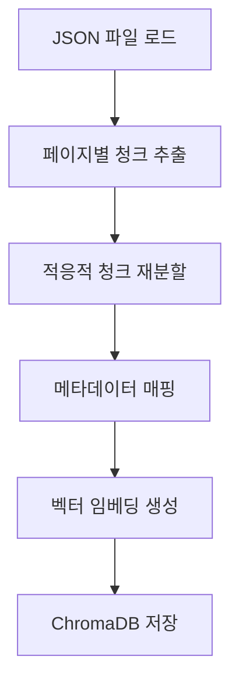
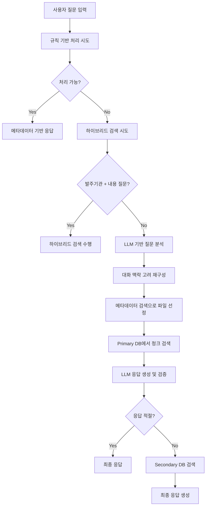

# 중급 프로젝트 | RFP 내용 요약 서비스 구현
- 보고서 다운로드 링크 : https://drive.google.com/file/d/16lKYOQV7HHHBKJLPud8fL-dPQrI8cGHK/view?usp=sharing
---
## 목차

1. [프로젝트 개요](#프로젝트-개요)  
2. [설치 및 실행](#설치-및-실행)  
3. [사용법](#사용법)
4. [프로젝트 구조](#프로젝트-구조)
5. [모듈 설명](#모듈-설명)
6. [개발 환경](#개발-환경)  
7. [시스템 아키텍처](#시스템-아키텍처)  
8. [워크플로우](#워크플로우)  
9. [핵심 기능](#핵심-기능)  
10. [성능 최적화](#성능-최적화)  
11. [향후 개선사항](#향후-개선사항)
12. [결론](#결론)
13. [주의사항](#주의사항)
14. [라이센스](#라이센스)


---

## 프로젝트 개요

### 프로젝트 목적

본 프로젝트의 목적은 자연어처리(NLP)와 LLM을 활용하여 RAG 시스템을 구축하고, 복잡한 형태의 기업 및 정부 제안요청서(RFP)로부터  핵심 정보를 추출하고 요약하여 사용자에게 **핵심 정보를 전달**하는 시스템을 구축하는 데 있습니다. 이를 통해 RFP 내 주요 요구 조건, 대상 기관, 예산, 제출 방식 등 중요한 정보를 **신속하고 정확**하게 파악할 수 있습니다. 위 서비스를 활용하여, ‘입찰메이트’의 컨설턴트들이 방대한 RFP 문서를 빠르게 분석하고, 고객사에게 **양질의 컨설팅을 제공**하는 기초가 될 것입니다.

### 개발 시 중점사항

- **정확한 정보 검색**: 사용자 질문에 대해 관련성 높은 문서 내용 제공
- **대화 맥락 유지**: 연속된 질문에서 이전 대화 내용을 고려한 응답 생성
- **다양한 질문 유형 지원**: 메타데이터 조회, 문서 내용 검색, 비교 분석 등
- **확장 가능한 구조**: 모듈화를 통한 유지보수성 및 확장성 확보

### 시스템 특징

- **하이브리드 검색**: 메타데이터 기반 + 문서 내용 기반 검색
- **LLM 호출 최적화**: 불필요한 API 호출 최소화
- **다중 문서 DB 지원**: Primary/Secondary DB를 통한 검색 품질 향상
- **대화 맥락 관리**: 이전 대화 내용을 고려한 질문 재구성

---

## 설치 및 실행

1. **의존성 설치**
```bash
pip install -r requirements.txt
```

2. **환경변수 설정**
`.env` 파일을 생성하고 다음 내용을 추가:

```env
# === 필수 설정 ===
# OpenAI API 키
OPENAI_API_KEY=your_openai_api_key_here

# RAG 시스템 파일 경로 (반드시 설정 필요)
MUP_FILE_PATH=data/merged_mup_data.json
PLUMBER_FILE_PATH=data/merged_plumber_data.json
METADATA_PATH=data/data_list.csv

# === 선택적 설정 ===
# GPU 메모리 최적화 (GPU 사용 시 권장)
PYTORCH_CUDA_ALLOC_CONF=max_split_size_mb:512

# 문서 처리 파이프라인 경로 (문서 처리 기능 사용 시만 필요)
HWP_FILES_DIR=files
PDF_OUTPUT_DIR=pdf_files
PDF_INPUT_DIR=pdf_input
PDFPLUMBER_OUTPUT_DIR=output/pdfplumber
PDFPLUMBER_JSON_DIR=output/pdfplumber_json
PYMUPDF_OUTPUT_DIR=output/pymupdf
PYMUPDF_JSON_DIR=output/pymupdf_json

# 전처리 경로 (JSON 전처리 기능 사용 시만 필요)
PDFPLUMBER_PATH=output/pdfplumber_json
PYMUPDF_PATH=output/pymupdf_json
```

**중요**: `.env` 파일을 참고하여 본인 환경에 맞게 경로를 설정하세요.

---

## 사용법

### 1. RAG 시스템 실행

#### 기본 실행 (사전 정의된 질문 사용)
```bash
python main.py
```
또는
```bash
python main.py --mode predefined
```

#### 대화형 모드 실행
```bash
python main.py --mode interactive
```

#### 사용자 정의 질문으로 실행
```bash
python main.py --mode predefined --questions "첫 번째 질문" "두 번째 질문" "세 번째 질문"
```

**실행 모드 설명:**
- **predefined**: 사전에 정의된 질문들을 순차적으로 처리 (기본값)
- **interactive**: 사용자가 직접 질문을 입력하여 대화형으로 진행

**명령행 옵션:**
- `--mode`: 실행 모드 선택 (`predefined` 또는 `interactive`)
- `--questions`: 사용자 정의 질문 리스트 (predefined 모드에서만 사용)

**사용 예시:**
```bash
# 기본 모드 (사전 정의된 질문 사용)
python main.py

# 대화형 모드
python main.py --mode interactive

# 특정 질문들만 테스트
python main.py --mode predefined --questions "공고 번호가 20240821893인 사업 이름이 뭐야?" "사업 금액이 가장 큰 사업은 뭐야?"

# 단일 질문 테스트
python main.py --mode predefined --questions "국민연금공단이 발주한 이러닝시스템 관련 사업 요구사항을 알려줘."
```

### 2. 문서 처리 파이프라인 실행

**전체 파이프라인 (HWP → PDF → 텍스트 추출 → 전처리)**
```bash
python document_pipeline_main.py --mode full
```

**텍스트 추출만 실행**
```bash
python document_pipeline_main.py --mode extract
```

**전처리만 실행**
```bash
python document_pipeline_main.py --mode preprocess
```

### 3. 개별 스크립트 실행

**HWP를 PDF로 변환**
```bash
python scripts/convert_hwp_to_pdf.py --hwp-dir files --pdf-dir pdf_files
```

**PDFPlumber로 텍스트 추출**
```bash
python scripts/extract_with_pdfplumber.py --input-dir pdf_files --output-dir output/pdfplumber --json-dir output/pdfplumber_json
```

**PyMuPDF로 텍스트 추출**
```bash
python scripts/extract_with_pymupdf.py --input-dir pdf_files --output-dir output/pymupdf --json-dir output/pymupdf_json
```

**텍스트 전처리**
```bash
python scripts/preprocess_documents.py --pymupdf-path output/pymupdf_json --pdfplumber-path output/pdfplumber_json
```

---

## 프로젝트 구조

```
rag_project/
├── .env                           # 환경변수 파일
├── .gitignore                     # Git 무시 파일
├── requirements.txt               # 의존성 패키지
├── main.py                       # RAG 시스템 메인 실행 파일
├── document_pipeline_main.py     # 문서 처리 파이프라인 메인 파일
├── config/
│   └── settings.py               # 설정 관리
├── models/
│   └── embeddings.py             # 임베딩 모델 관리
├── data/
│   ├── __init__.py
│   ├── loader.py                 # 데이터 로드 기능
│   └── preprocessor.py           # 데이터 전처리 기능
├── database/
│   ├── __init__.py
│   ├── vector_db.py              # 벡터 DB 생성 및 관리
│   └── metadata_db.py            # 메타데이터 DB 관리
├── search/
│   ├── __init__.py
│   ├── metadata_search.py        # 메타데이터 검색
│   ├── hybrid_search.py          # 하이브리드 검색
│   └── document_search.py        # 문서 검색
├── conversation/
│   ├── __init__.py
│   ├── manager.py                # 대화 맥락 관리
│   └── llm_processor.py          # LLM 기반 처리
├── utils/
│   ├── __init__.py
│   ├── text_utils.py             # 텍스트 처리 유틸리티
│   └── display_utils.py          # 출력 관련 유틸리티
├── response/
│   ├── __init__.py
│   └── generator.py              # 응답 생성
├── document_processing/          # 문서 처리 모듈
│   ├── __init__.py
│   ├── hwp_converter.py          # HWP → PDF 변환
│   ├── pdf_extractors/
│   │   ├── __init__.py
│   │   ├── pdfplumber_extractor.py    # PDFPlumber 텍스트 추출
│   │   └── pymupdf_extractor.py       # PyMuPDF 텍스트 추출
│   ├── text_preprocessor.py      # 텍스트 전처리
│   └── pipeline.py               # 전체 문서 처리 파이프라인
└── scripts/                      # 독립 실행 스크립트
    ├── convert_hwp_to_pdf.py     # HWP 변환 스크립트
    ├── extract_with_pdfplumber.py    # PDFPlumber 추출 스크립트
    ├── extract_with_pymupdf.py       # PyMuPDF 추출 스크립트
    └── preprocess_documents.py       # 문서 전처리 스크립트
```

---

## 모듈 설명

### config/settings.py
- 환경변수 관리
- API 키 설정
- 파일 경로 설정
- 모델 및 검색 파라미터 설정

### models/embeddings.py
- 한국어 특화 임베딩 모델 로드
- HuggingFace SBERT 모델 사용

### data/
- **loader.py**: JSON, CSV 데이터 로드
- **preprocessor.py**: 메타데이터 전처리 (날짜, 금액 변환)

### database/
- **vector_db.py**: 문서 벡터 DB 생성
- **metadata_db.py**: 메타데이터 벡터 DB 생성

### search/
- **metadata_search.py**: 규칙 기반 메타데이터 검색
- **hybrid_search.py**: 발주기관 + 내용 하이브리드 검색
- **document_search.py**: 메인 검색 처리 로직

### conversation/
- **manager.py**: 대화 맥락 관리 클래스
- **llm_processor.py**: LLM 기반 질문 분석 및 처리

### response/generator.py
- 컨텍스트 기반 응답 생성

### utils/
- **text_utils.py**: 텍스트 정리 유틸리티
- **display_utils.py**: 출력 포맷팅 유틸리티
---

## 개발 환경

### 플랫폼 및 도구

- **개발 환경**: Google Colab Pro
- **Python 버전**: 3.11
- **주요 라이브러리**:
    - `langchain` (0.2.x): 벡터 DB 및 텍스트 처리
    - `langchain-openai`: GPT 모델 연동
    - `langchain-huggingface`: 한국어 임베딩 모델
    - `chromadb`: 벡터 데이터베이스
    - `pandas`, `numpy`: 데이터 처리
    - `openai`: LLM API 연동

### 모델 및 API

- **LLM**: GPT-4.1-mini (OpenAI)
- **임베딩 모델**: `snunlp/KR-SBERT-V40K-klueNLI-augSTS` (한국어 특화)
- **벡터 DB**: ChromaDB (로컬 저장)

### 데이터 구조

```json
{
  "filename": "사업파일명.json",
  "page_number": 1,
  "merged_page_content": "페이지 내용..."
}

```
---

## 시스템 아키텍처

### 전체 시스템 구조

```

[사용자 질문]
    ↓
[질문 분석 및 재구성] ← LLM (GPT-4.1-mini)
    ↓
[검색 방식 결정]
    ├── 규칙 기반 메타데이터 처리
    ├── 하이브리드 검색 (발주기관 + 내용)
    └── 일반 검색 (메타데이터 → 문서 내용)
    ↓
[다중 DB 검색]
    ├── Primary DB (MUP 데이터)
    └── Secondary DB (Plumber 데이터)
    ↓
[응답 생성 및 검증] ← LLM (GPT-4.1-mini)
    ↓
[최종 응답 출력]

```

### 데이터베이스 구조

- **메타데이터 벡터 DB**: 사업명 + 발주기관 임베딩
- **문서 벡터 DB (Primary)**: MUP 데이터 청크 임베딩
- **문서 벡터 DB (Secondary)**: Plumber 데이터 청크 임베딩
- **메타데이터 DataFrame**: 구조화된 사업 정보

---

## 워크플로우

### 1. 데이터 전처리 단계



### 2. 질문 처리 워크플로우



### 3. 대화 맥락 관리

- **엔티티 추출**: 사업명, 발주기관, 파일명 등
- **맥락 연결 판단**: 지시어, 복수 참조 표현 등 분석
- **질문 재구성**: 이전 대화를 고려한 구체적 질문 생성

---

## 핵심 기능

### 1. 지능형 질문 분석

```python
def process_with_llm(query, conversation_context, df, chat):
    """
    LLM을 통한 질문 분석:
    - metadata_only: 메타데이터만으로 처리 가능 여부
    - rule_based_query: 규칙 기반 처리 가능 여부
    - reformulated_query: 대화 맥락 고려한 질문 재구성
    - entities: 사업명-발주기관 페어 추출
    - search_keywords: 문서 검색용 핵심 키워드
    """

```

### 2. 다중 검색 전략

### 규칙 기반 메타데이터 처리

- 사업 금액 관련: "가장 큰", "최대", "이상" 등 패턴 인식
- 발주 기관 관련: "모든", "전체", "리스트" 등
- 날짜 관련: "최근", "가장 최근", "오래된" 등

### 하이브리드 검색

- 발주기관 + 내용 관련 질문 감지
- 메타데이터로 파일 선정 → 해당 파일 내 내용 검색

### 일반 검색

- 엔티티 기반 메타데이터 검색으로 파일 선정
- 키워드 기반 청크 검색
- Primary/Secondary DB 순차 검색

### 3. 대화 맥락 관리

```python
class ConversationManager:
    """
    - 최근 대화 기록 유지 (기본 5개)
    - 엔티티 추출 및 저장
    - 맥락 기반 질문 재구성 지원
    """

```

**맥락 연결 규칙**:

- 지시어 기반: "그럼", "그", "해당" → 직전 질문 연결
- 복수 참조: "각각", "둘 다" → 이전 언급 사업들 참조
- 새로운 범위: "다른", "별도" → 맥락 연결 방지

---


## 성능 최적화

### 1. LLM 호출 최적화

- **Before**: 질문당 평균 3-4회 호출
- **After**: (규칙기반,하이브리드 처리시 1회), 질문당 평균 2회 호출 (기본) + 필요시 1회
- **절약 효과**: 약 25-40% API 비용 감소

### 2. 검색 효율성 향상

- **파일 타겟팅**: 전체 문서 → 관련 파일 내 검색
- **청크 수 제한**: 파일별 5개로 제한
- **임계값 조정**: 유사도 점수 기반 필터링

### 3. 메모리 사용 최적화

- 청크 재분할을 통한 균등한 크기 분포
- 불필요한 중간 데이터 정리
- 벡터 DB persist 활용으로 재로딩 시간 단축

### 4. 응답 시간 단축

- 규칙 기반 처리 우선순위로 즉시 응답
- 하이브리드 검색으로 불필요한 전체 검색 방지
- 대화 맥락 기반 질문 재구성으로 검색 정확도 향상

---

## 향후 개선사항

### 1. 성능 개선

- **비동기 처리**: 다중 DB 검색 병렬화
- **캐싱 시스템**: 자주 검색되는 질문 결과 캐시
- **스트리밍 응답**: 긴 응답의 실시간 출력
- **배치 처리**: 여러 질문 동시 처리

### 2. 기능 확장

- **파일 업로드**: 새로운 문서 실시간 추가
- **이미지/표 처리**: 문서 내 시각적 요소 분석
- **요약 기능**: 긴 문서의 자동 요약
- **키워드 하이라이팅**: 관련 부분 강조 표시

### 3. 모니터링 및 분석

- **로깅 시스템**: 상세한 처리 과정 로그
- **성능 메트릭**: 응답 시간, 정확도 등 측정
- **사용 패턴 분석**: 자주 묻는 질문 유형 파악
- **A/B 테스트**: 다양한 전략 성능 비교

---

## 결론

본 프로젝트를 통해 공공입찰 공고 문서에 대한 효율적인 질의응답 시스템을 구축했습니다. 특히 대화 맥락을 고려한 지능형 검색과 LLM 호출 최적화를 통해 실용적이고 비용 효율적인 솔루션을 개발했습니다.

### 주요 성과

- **검색 정확도 개선**: 하이브리드 검색 전략으로 관련성 높은 결과 제공
- **비용 최적화**: LLM 호출 횟수 25-40% 감소
- **사용자 경험 향상**: 자연스러운 대화형 인터페이스
- **확장 가능성**: 모듈화된 구조로 향후 확장 용이

### 기술적 기여

- 한국어 특화 임베딩 모델 활용
- 대화 맥락 기반 질문 재구성 알고리즘
- 다중 검색 전략의 효율적 통합
- LLM 기반 응답 검증 시스템

이 시스템은 공공입찰 정보 접근성을 크게 향상시킬 수 있으며, 유사한 문서 기반 질의응답 시스템 개발에도 활용할 수 있는 범용적인 아키텍처를 제공합니다.

---

## 주의사항

- **Windows 환경**: HWP 변환 기능은 Windows와 한글과컴퓨터 한/글이 설치된 환경에서만 작동합니다.
- **API 키**: OpenAI API 키가 필요합니다.
- **CUDA**: GPU 가속을 위해서는 CUDA 설치가 권장됩니다.

---

## 라이센스

이 프로젝트는 원본 코드의 모든 로직과 주석을 보존하면서 모듈화한 버전입니다.
